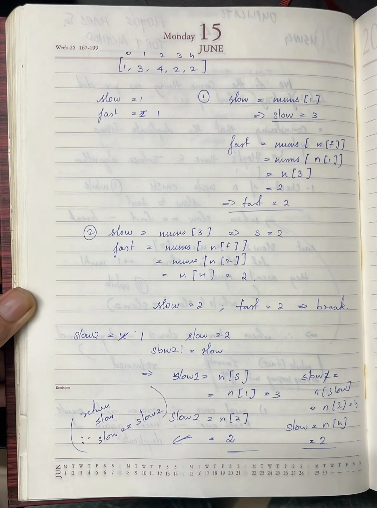
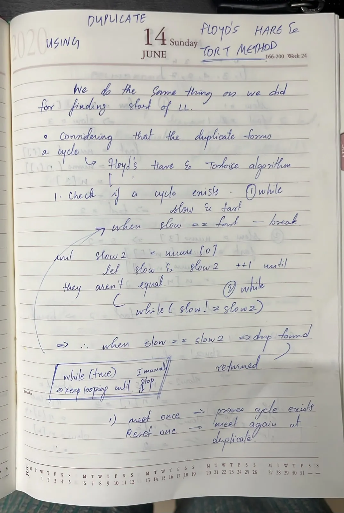

notes :
- hashset
- check for presence if yes return
- add
- fast slow ptr solution - imgs

else :
boolean array called visited - true for all elements that has been visited, if it has been visited already, return num